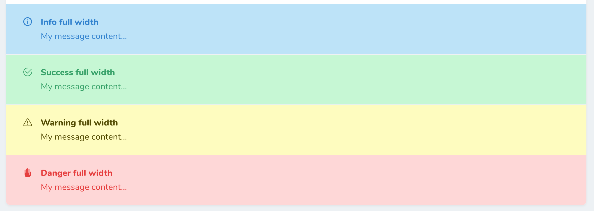
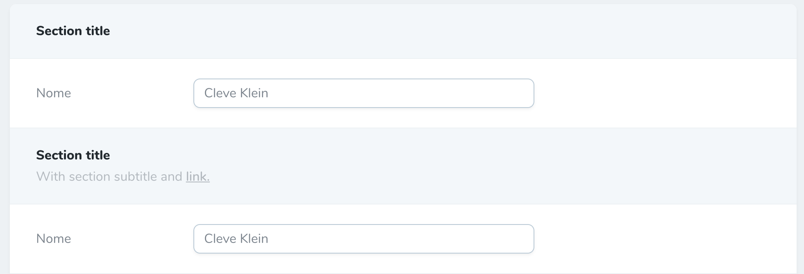
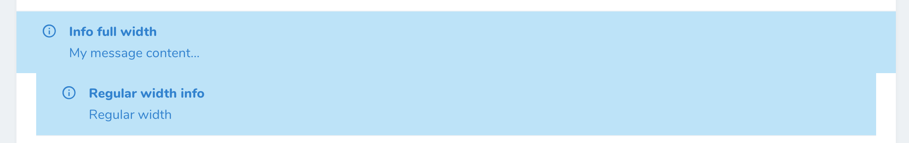
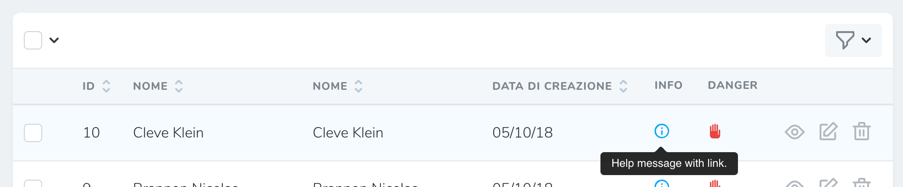

# Laravel Nova Help Field

A custom Nova fields which allows to show custom help messages within form, detail and index screens.


## Changelog

See [changelog here](changelog.md).

## Install

Run this command in your nova project: 

```bash
composer require comodolab/nova-help
```

Then you can use the field in your resource as follow:

```php
use Comodolab\Nova\Fields\Help\Help;

public function fields(Request $request)
{
    return [
        Help::make('Help title', 'Help message!'),
    ];
}
```


## Options

**Nova Help Field** has many options as follow:

### Default templates

```php
Help::make('title', 'message'); // Default help message
Help::success('title', 'message');
Help::info('title', 'message');
Help::warning('title', 'message');
Help::danger('title', 'message');

// There's also a special template for headings
Help::header('title', 'subtitle');

// If you prefer you can call the non static type method
Help::make('title', 'message')->type('warning'); 
```
#### Help templates:

#### Headings template:


### Both title and message are optional

```php
Help::make('Only title');
Help::make()->message('Only message');
```

### Messages can also be callable

```php
Help::make()->message(function () {
    return "{$this->name} is awesome!";
});
```

### Icons

You can pick one of the default SVG icons (http://www.zondicons.com/) provided by [Steve Schoger](https://twitter.com/steveschoger).

```php
Help::make('Title')->icon('help'); // the default one
Help::make('Title')->icon('info');
Help::make('Title')->icon('warning');
Help::make('Title')->icon('danger');
// Load a custom one
Help::make('Love you')
    ->message('Yes, I love you!')
    ->icon('<svg viewBox="0 0 20 20" xmlns="http://www.w3.org/2000/svg"><path d="m10 3.22-.61-.6a5.5 5.5 0 0 0 -7.78 7.77l8.39 8.39 8.39-8.4a5.5 5.5 0 0 0 -7.78-7.77z"/></svg>');
// or show no icon at all
Help::make('Sad')->withoutIcon();
```


### Render html messages

```php
Help::make('Title', 'Message with <a href="#">link</a>')->displayAsHtml();
```

From v0.2 the `displayAsHtml()` method applies also to the field name (unless shown as column header on index).

### Full width on details screen

```php
// Remove annoing padding in detail screen, also the default behaviour for the heading template 
Help::make('Negative margin')->showFullWidthOnDetail();
```



### With side label

```php
// Show a side label instead of the title on the top
Help::make('Look I\'m on the side')
    ->message('I\'m not...')
    ->withSideLabel();
```


### Collapsible help fields

Help fields can be made collapsible using the fluent method `collapsible()`. 
Collapsible help fields are collapsed by default and toggle their state clicking on their title.
Also, keep in mind that collapsible fields must define both a title and message and cannot be used with side labels.

```php
// Collapsible field
Help::info('Click here to toggle', 'Lorem ipsum dolor sit amet...')
    ->collapsible();
```


### Show help messages on index

```php
/**
 * By default help messages aren't shown on index,
 * when enabled they are shown as an hoverable 
 * icon showing a plain (no html) tooltip.
 */
Help::make('Column title')
    ->message('Message with <a href="#">link</a>') // The link code will be stripped out on index
    ->alsoOnIndex();
    
// Field icons can be shown conditionally on index
Help::make()->message(function () {
    return $this->name?"{$this->name} is awesome!":null;
})->onlyOnIndex();
```


